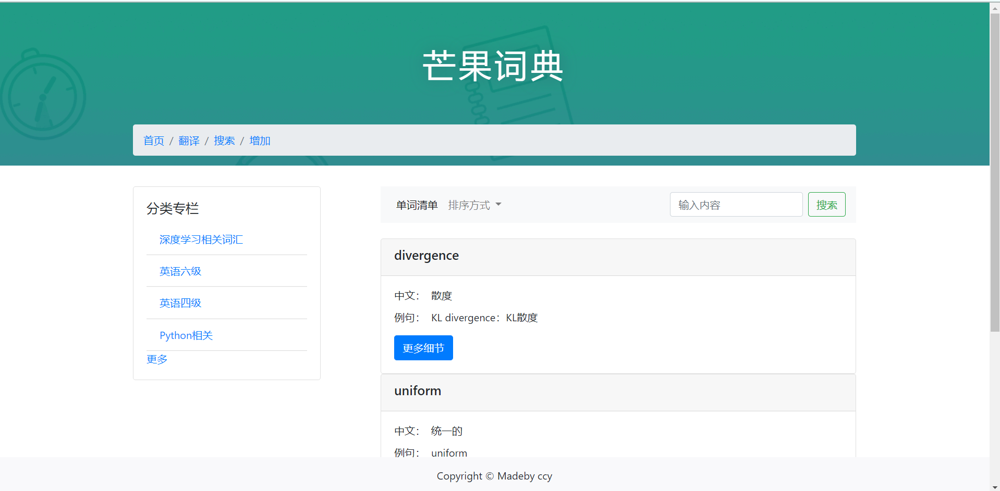
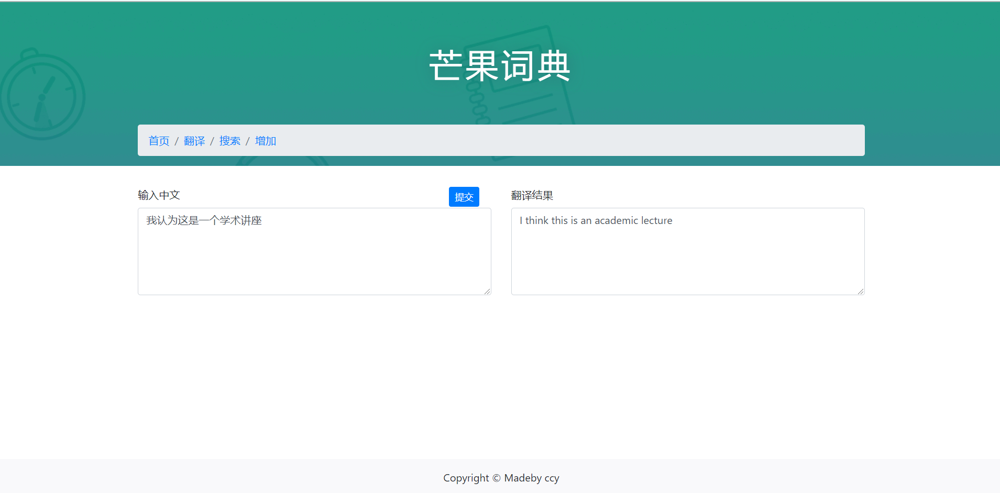
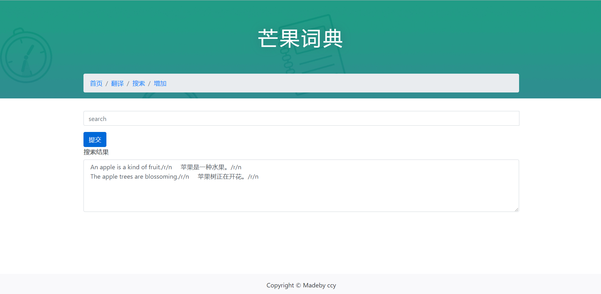
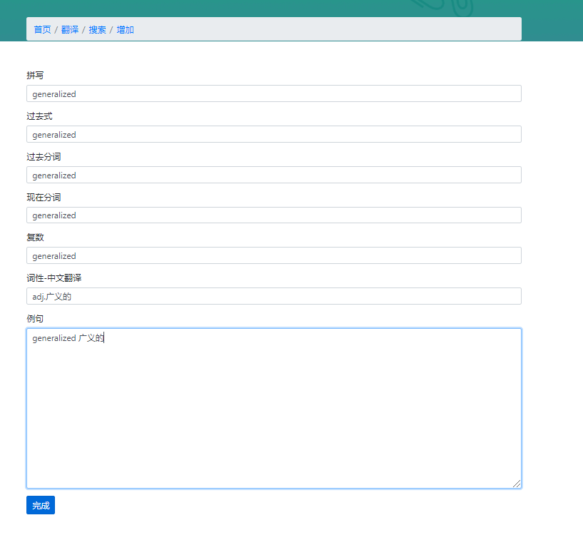

# MangoDict
Django+Bootstrap4 简单实现一个英语词典，可以进行插入词汇，查询，在线翻译等功能

#### 首页展示

#### 在线翻译

#### 搜索

#### 增加

***

#### 如何运行

1. 在setting中修改数据库配置
2. 在线翻译功能可能由于爬虫过期而无法使用（可跳过）

~~~
后台启动：
cd wordbook
python manage.py runserver
前端访问：
http://127.0.0.1:8000/dict/word-list/
~~~

